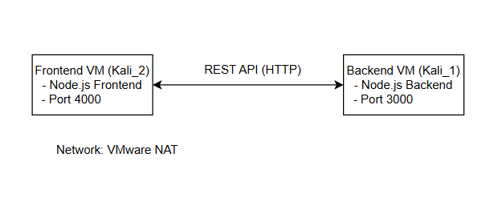

# Connection-between-VMs
Assignment 1 submission of the Virtualization and Cloud Computing Course

## Objective
The objective of this project is to create and configure multiple virtual machines using a virtualization platform, establish a network between them, and deploy a microservice-based application across the connected virtual machines.

This project demonstrates inter-VM communication, microservice architecture, and distributed system principles.

---

## System Overview
- Host Operating System: Windows
- Virtualization Platform: VMware Workstation
- Guest Operating Systems: Kali Linux (2 Virtual Machines)
- Network Type: Host-only Network (VMnet1)
- Communication Protocol: HTTP (REST APIs)

---

## Architecture Design

The system consists of two independent virtual machines connected to common IITJ network.

- **Backend VM**
  - Hosts a Node.js backend microservice
  - Exposes REST APIs on port 3000

- **Frontend VM**
  - Hosts a Node.js frontend/client microservice
  - Communicates with backend via REST APIs on port 4000



---

## Virtual Machine Configuration

Two Kali Linux virtual machines were created using VMware Workstation.

### VM Details
| VM Name | Role | OS | Port |
|-------|------|----|------|
| kali_1 | Backend Service | Kali Linux | 3000 |
| kali_2 | Frontend Service | Kali Linux | 4000 |

### Network Configuration
- Network Adapter Type: Host-only
- VMware Network: VMnet1
- Both VMs were assigned IP addresses within the same subnet
- Connectivity verified using `ping`

---

## Microservice Implementation

### Backend Microservice
- Technology: Node.js + Express.js
- File Location: `backend/backend.js`
- Functionality:
  - Exposes `/backend` endpoint
  - Can initiate a request to frontend service

### Frontend Microservice
- Technology: Node.js + Express.js
- File Location: `frontend/frontend.js`
- Functionality:
  - Exposes `/frontend` endpoint
  - Can initiate a request to backend service

---

## Two-Way Communication Demonstration

Bidirectional communication was established between the two microservices.

### Frontend → Backend
```bash
curl http://<BACKEND_VM_IP>:3000/backend
